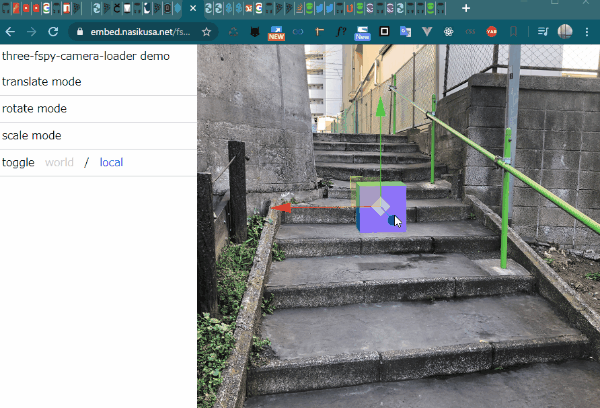
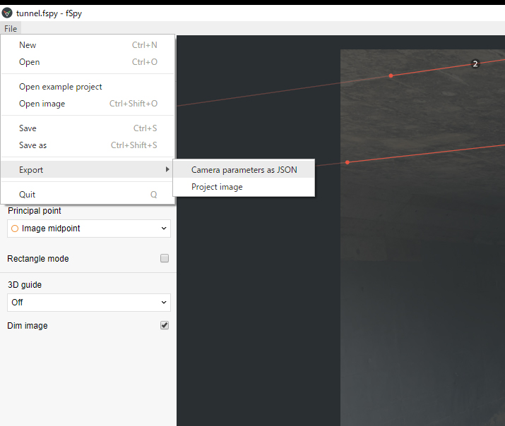
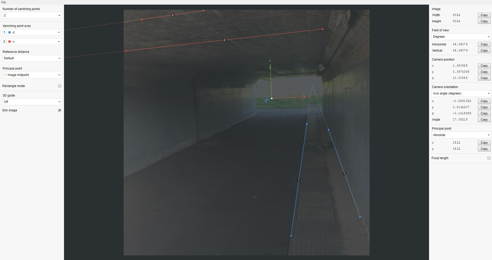

# three-fspy-camera-loader



[demo page](https://embed.nasikusa.net/fspy-three-demo/)

## What is this?

Script for importing [fSpy](https://fspy.io/) camera data into [three.js](https://threejs.org/).

You can create a pseudo AR-like visual representation.

I made [a demo on this page](https://embed.nasikusa.net/fspy-three-demo/).

It takes in the json format camera data output by fSpy and converts it into the [PerspetiveCamera](https://threejs.org/docs/#api/en/cameras/PerspectiveCamera) of three.js.

three-fspy-camera-loader inherits the [Loader](https://threejs.org/docs/#api/en/loaders/Loader) object of three.js and can be used in the same way as other loaders.

I'm Japanese so I'm not good at English. So I'm sorry if I used the wrong English.

## Installing from npm

`$ npm install --save three-fspy-camera-loader`

## Link Collection

[fSpy official website](https://fspy.io/)

[fspy repository](https://github.com/stuffmatic/fSpy)

[fSpy video](https://vimeo.com/300690108)

[fSpy importer addon for Blender](https://github.com/stuffmatic/fSpy-Blender)

## Getting Started

```javascript
var loader = new FSpyCameraLoader();
var camera;

loader.load(
  'path/to/fSpyJsonFile',
  // onload
  function ( result ) {
    camera = result;
  },
  // onprogress
  function ( xhr ) {
    console.log( ( xhr.loaded / xhr.total * 100 ) + '% loaded' );
  },
  // onerror
  function ( error ) {
    console.log( 'ERROR' );
  }
);
```

If you want to include a background image, you can use the following example. Of course, other methods are also acceptable.

```css
html,body {
  margin: 0;
  padding: 0;
  height: 100%;
  overflow: hidden;
}
#myCanvas {
  width: 100%;
  height: 100%;
  background-image: url(path/to/image);
  background-size: cover;
  background-position: 50% 50%;
  background-repeat: no-repeat;
}
```

```javascript

var camera;

var renderer = new THREE.WebGLRenderer({
  canvas: document.querySelector('#myCanvas'),
  alpha: true,
});
renderer.setPixelRatio(window.devicePixelRatio);
renderer.setClearColor(0x000000, 0);
renderer.setSize(window.innerWidth, window.innerHeight);

var scene = new THREE.Scene();
var geometry = new THREE.BoxGeometry(3, 3, 3);
var material = new THREE.MeshNormalMaterial();
var box = new THREE.Mesh(geometry, material);
box.position.set(0, 0, 0);
scene.add(box);

var fSpyCameraLoader = new FSpyCameraLoader();
fSpyCameraLoader.setCanvas(document.querySelector('#myCanvas'));
// If you want to make the behavior behave like CSS background-size: cover, use this function.
fSpyCameraLoader.setResizeUpdate();

fSpyCameraLoader.load('path/to/fSpyJson', function ( result ) {
  camera = result;
  renderLoop();
});

window.addEventListener('resize', function () {
  renderer.setSize(window.innerWidth, window.innerHeight);
});

function renderLoop() {
  requestAnimationFrame(renderLoop);
  renderer.render(scene, camera);
  box.rotation.y += 0.01;
}

```

## Notice

### json export

You can export json using fSpy from here.



### Axis setting

When using with three.js, it is recommended that the Y-axis be up.



## API documentation

Please see [here](./docs/globals.md).

## LISENCE

MIT
